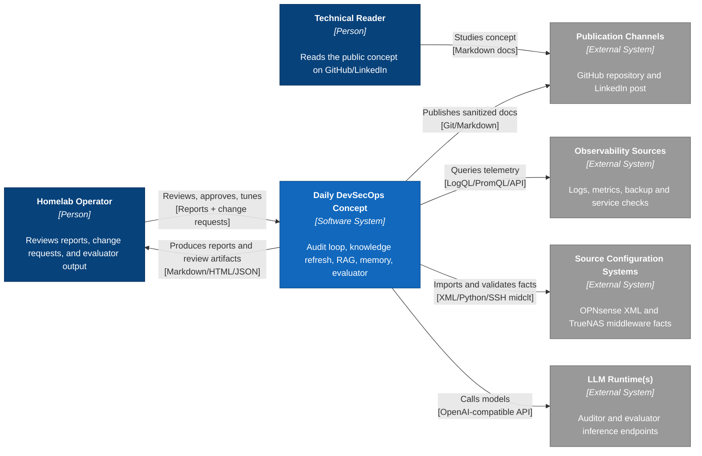

# C1 — System Context

This context diagram frames the project as a combined **Daily DevSecOps + Homelab LLM Wiki Knowledge Stack**, not only as a daily audit workflow.

Generated/maintained using the project `c4-diagram` skill conventions with C4-style Mermaid flowchart notation.

## Context explanation

### Primary actor

The primary actor is the homelab operator. The operator wants a concise daily answer to:

- What broke?
- What is recurring?
- What changed in infrastructure state?
- Which wiki/runbook facts are stale?
- What needs human approval?
- Can I trust the generated report?

### Secondary audience

The public documentation audience is a technical reader who wants to understand the architecture pattern, not deploy the private environment.

### External systems

| External system | Role |
|---|---|
| Observability Sources | Provide operational evidence: logs, metrics, backup markers, service health, and runtime signals. |
| Source Configuration Systems | Provide source-of-truth configuration and live facts: OPNsense XML export and TrueNAS middleware queries. |
| LLM Runtime(s) | Provide local audit analysis and evaluator scoring through OpenAI-compatible interfaces. |
| Publication Channels | Host sanitized architecture documentation and code snippets. |

## Boundary note

The public concept intentionally abstracts away exact hostnames, IPs, credentials, workflow IDs, and private operational data.
