# C2 — Container View

This container diagram shows the main runtime and storage containers. It now includes the **Knowledge Import Pipeline** as a first-class container because OPNsense and TrueNAS update flows feed the information stack used by the daily audit.

Generated/maintained using the project `c4-diagram` skill conventions with C4-style Mermaid flowchart notation.

```mermaid
flowchart LR
    %% 1. Actors
    Operator["<b>Homelab Operator</b><br/><i>[Person]</i><br/><br/>Reviews reports and approves change requests"]

    %% 2. System Boundary with Containers
    subgraph Boundary["Daily DevSecOps Concept"]
        direction LR
        Orchestration["<b>Workflow Orchestration</b><br/><i>[Container: n8n + JS Code + LangChain nodes]</i><br/><br/>Schedules and coordinates audit, import, evaluator, and side effects"]
        Evidence["<b>Telemetry Evidence Processor</b><br/><i>[Container: Loki + Prometheus + JS enrichment]</i><br/><br/>Filters, suppresses, clusters, and enriches operational evidence"]
        ImportPipeline["<b>Knowledge Import Pipeline</b><br/><i>[Container: Python + OPNsense XML + n8n SSH midclt]</i><br/><br/>Detects config/wiki drift and stages corrections"]
        AuditAgent["<b>AI Audit Agent</b><br/><i>[Container: n8n AI agent + llama.cpp/OpenAI API]</i><br/><br/>Generates grounded daily DevSecOps report"]
        Evaluator["<b>Evaluator Workflow</b><br/><i>[Container: n8n + deterministic checks + evaluator LLM]</i><br/><br/>Scores report quality, grounding, severity, formatting, and safety"]
        Vault[("<b>Markdown Knowledge Base</b><br/><i>[ContainerDb: Markdown vault + Git]</i><br/><br/>Approved runbooks, inventory, concepts, managed blocks")]
        Vector[("<b>Vector Retrieval Layer</b><br/><i>[ContainerDb: Qdrant + embeddings]</i><br/><br/>Wiki chunks and DevSecOps case-card memory")]
        Artifacts[("<b>Artifact and Review Store</b><br/><i>[ContainerDb: Filesystem + review inbox]</i><br/><br/>Reports, previews, run evidence, change requests, scorecards")]
    end

    %% 3. External Systems
    Observability["<b>Observability Sources</b><br/><i>[External System: Loki, Prometheus, Grafana, exporters]</i><br/><br/>Logs, metrics, backup markers, service checks"]
    SourceConfig["<b>Source Configuration Systems</b><br/><i>[External System: OPNsense + TrueNAS]</i><br/><br/>Gateway XML export and live middleware facts"]
    LLMRuntime["<b>LLM Runtime(s)</b><br/><i>[External System: local/evaluator model endpoints]</i><br/><br/>Inference for audit and scoring"]

    %% Relationships - left to right flow
    Operator -->|"Starts/reviews<br/>[UI, Git, Markdown]"| Orchestration
    Orchestration -->|"Queries checks<br/>[LogQL/PromQL/API]"| Observability
    Observability -->|"Evidence"| Evidence
    Orchestration -->|"Runs import/checks<br/>[Python + SSH]"| ImportPipeline
    SourceConfig -->|"Config and live facts<br/>[XML + midclt]"| ImportPipeline
    ImportPipeline -->|"Stages corrections<br/>[Change requests]"| Artifacts
    Operator -->|"Approves/rejects<br/>[Human gate]"| Artifacts
    Artifacts -->|"Approved updates<br/>[wiki_ops merge]"| Vault
    Vault -->|"Chunks and embeds<br/>[sync]"| Vector
    Evidence -->|"Compact evidence<br/>[JSON]"| AuditAgent
    Vector -->|"Runbooks and case memory<br/>[Vector search]"| AuditAgent
    AuditAgent -->|"Model calls<br/>[OpenAI-compatible API]"| LLMRuntime
    AuditAgent -->|"Report, preview, case card<br/>[MD/HTML/JSON]"| Artifacts
    Artifacts -->|"DEV run evidence<br/>[Files]"| Evaluator
    Evaluator -->|"Scorecard<br/>[JSON/Markdown]"| Artifacts
    Evaluator -->|"Evaluator model calls<br/>[OpenAI-compatible API]"| LLMRuntime

    %% C4 Styling
    classDef person fill:#08427B,stroke:#052E56,color:#fff
    classDef container fill:#438DD5,stroke:#2E6295,color:#fff
    classDef database fill:#438DD5,stroke:#2E6295,color:#fff
    classDef external fill:#999999,stroke:#6B6B6B,color:#fff

    class Operator person
    class Orchestration,Evidence,ImportPipeline,AuditAgent,Evaluator container
    class Vault,Vector,Artifacts database
    class Observability,SourceConfig,LLMRuntime external
```

## Container responsibilities

| Container | Technology | Responsibility |
|---|---|---|
| Workflow Orchestration | n8n, JS Code nodes, LangChain nodes | Coordinates scheduled/manual execution, sub-workflows, agent tools, report rendering, artifact writing, and side-effect boundaries. |
| Telemetry Evidence Processor | Loki, Prometheus, Grafana APIs, JS enrichment | Collects and compresses logs/metrics into deterministic evidence for the audit agent. |
| Knowledge Import Pipeline | Python, OPNsense XML, n8n SSH workflow, TrueNAS `midclt` | Keeps the wiki aligned with gateway configuration and live storage middleware facts. |
| AI Audit Agent | n8n AI Agent, local OpenAI-compatible LLM runtime, RAG tools | Produces a concise daily report using deterministic evidence and selective retrieval. |
| Evaluator Workflow | n8n, deterministic checks, evaluator LLM, golden fixtures | Reviews generated output for grounding, severity, formatting, safety, and usefulness. |
| Markdown Knowledge Base | Markdown, Obsidian-compatible vault, Git | Stores approved source-of-truth pages and machine-managed sections. |
| Vector Retrieval Layer | Qdrant, embeddings | Stores semantic wiki chunks and case-card memory for RAG and recurrence lookup. |
| Artifact and Review Store | Filesystem, review inbox, Markdown/HTML/JSON artifacts | Preserves reports, previews, evidence, scorecards, and change review artifacts. |

## Notes on abstraction

- Raw database tables, individual n8n nodes, and exact private file paths are intentionally omitted at C2.
- OPNsense and TrueNAS update internals are shown at C3 in [`c3-knowledge-base-update-flow.md`](c3-knowledge-base-update-flow.md).
- Evaluator internals are shown at C3 in [`c3-evaluation-flow.md`](c3-evaluation-flow.md).
