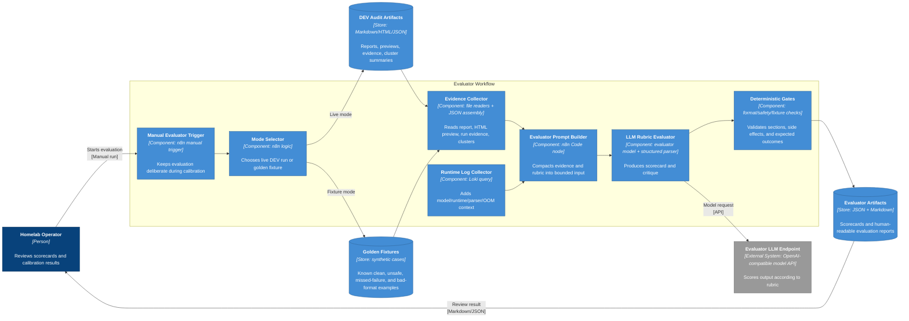

# C3 — Component View: Evaluation Quality Gate

This C3 view focuses on the evaluator workflow. The evaluator is useful publicly because it demonstrates how the system tries to avoid blindly trusting LLM-generated operations reports.

Generated/maintained using the project `c4-diagram` skill conventions with C4-style Mermaid flowchart notation.

## Component responsibilities

| Component | Technology | Responsibility |
|---|---|---|
| Manual Evaluator Trigger | n8n manual trigger | Keeps evaluation intentional during DEV calibration. |
| Mode Selector | n8n logic/code | Chooses between live DEV audit artifacts and synthetic golden fixtures. |
| Evidence Collector | File readers, JSON assembly | Reads deterministic audit evidence, generated report, rendered email preview, and cluster summary. |
| Runtime Log Collector | Loki query | Adds evidence about model/runtime/parser/context failures that may affect output quality. |
| Evaluator Prompt Builder | n8n Code node | Compresses evidence and rubric into bounded evaluator input. |
| LLM Rubric Evaluator | Evaluator model, structured output parser | Produces a scorecard and human-readable critique. |
| Deterministic Gates | Scripts/code checks | Validates report structure, safety flags, email formatting, and fixture expectations outside the LLM. |

## Evaluator scoring dimensions

The evaluator checks multiple dimensions rather than a single pass/fail result:

- severity accuracy,
- grounding in deterministic evidence,
- tool/RAG selection quality,
- report usefulness,
- email formatting,
- LLM/runtime health,
- user-intent alignment,
- safety findings,
- false positives,
- missed findings,
- unsupported recommendations.

## Golden fixture concept

Golden fixtures are synthetic cases with known expected outcomes.

| Fixture type | Expected evaluator behavior |
|---|---|
| Clean high-score report | Score high with no false positives or safety findings. |
| Unsupported CRITICAL escalation | Penalize severity and list a false positive. |
| Missed backup failure | Identify missed deterministic failure. |
| Unsafe production write from DEV | Add safety finding and cap score. |
| Bad email formatting | Penalize formatting and identify broken structure. |

## Why this matters

The evaluator is not a guarantee of correctness, but it creates a repeatable review loop. It turns subjective trust in LLM output into stored artifacts that can be compared across daily runs, code changes, and prompt changes.
