# C3 — Component View: Knowledge-base Import and Update Flow

This component view expands the **Knowledge Import Pipeline** container from the C2 diagram. It shows how OPNsense XML and TrueNAS live middleware checks keep the Markdown knowledge base fresh for the daily audit loop.

Generated/maintained using the project `c4-diagram` skill conventions with C4-style Mermaid flowchart notation.

```mermaid
flowchart LR
    %% 1. Actor
    Operator["<b>Homelab Operator</b><br/><i>[Person]</i><br/><br/>Exports configs, reviews change requests, approves merges"]

    %% 2. Source systems
    OpnXml["<b>OPNsense XML Export</b><br/><i>[External System]</i><br/><br/>Gateway/firewall/DHCP/NAT source config"]
    TruenasMidclt["<b>TrueNAS Middleware</b><br/><i>[External System]</i><br/><br/>Live storage/app/network facts"]

    %% 3. Components inside update flow
    subgraph UpdatePipeline["Knowledge Import Pipeline"]
        direction LR
        OpnIngest["<b>OPNsense Sanitizer + Diff</b><br/><i>[Component: Python XML parser + desired-state diff]</i><br/><br/>Masks secrets, normalizes config, compares managed wiki blocks"]
        TruenasCheck["<b>TrueNAS Wiki Correctness Tool</b><br/><i>[Component: n8n SSH + read-only midclt]</i><br/><br/>Collects live facts and compares them with service documentation"]
        ChangeRequest["<b>Change Document Generator</b><br/><i>[Component: Markdown change-document writer]</i><br/><br/>Stages full-page corrections for human review"]
        WikiOps["<b>Wiki Operations CLI</b><br/><i>[Component: Python + Git-aware merge/reject]</i><br/><br/>Applies approved change requests, updates ledger, inventory, and archive"]
    end

    %% 4. Data stores and downstream consumer
    Inbox[("<b>Review Inbox</b><br/><i>[Store: Markdown review artifacts]</i><br/><br/>Pending and archived change requests")]
    Vault[("<b>Markdown Knowledge Base</b><br/><i>[Store: approved Markdown + Git]</i><br/><br/>Runbooks, service pages, managed blocks")]
    Qdrant[("<b>Knowledge Vector Index</b><br/><i>[Store: Qdrant + embeddings]</i><br/><br/>RAG chunks for approved wiki content")]
    AuditAgent["<b>Daily Audit Agent</b><br/><i>[Component: n8n AI agent]</i><br/><br/>Retrieves fresh context during the daily audit"]

    %% Relationships
    Operator -->|"Exports config<br/>[Manual action]"| OpnXml
    OpnXml -->|"Sanitized import input<br/>[XML -> Markdown]"| OpnIngest
    TruenasMidclt -->|"Live facts<br/>[SSH midclt call]"| TruenasCheck
    Operator -->|"Runs/checks workflow<br/>[n8n UI or agent prompt]"| TruenasCheck
    OpnIngest -->|"Detected drift<br/>[Structured diff]"| ChangeRequest
    TruenasCheck -->|"Detected drift<br/>[Live-vs-doc comparison]"| ChangeRequest
    ChangeRequest -->|"Writes pending change<br/>[CHANGE_REQUEST_*.md]"| Inbox
    Operator -->|"Approves or rejects<br/>[Human review]"| Inbox
    Inbox -->|"Selected change request<br/>[merge/reject]"| WikiOps
    WikiOps -->|"Approved content<br/>[Markdown + Git]"| Vault
    WikiOps -->|"Rebuilds index<br/>[chunk + embed]"| Qdrant
    Vault -->|"Approved source text<br/>[Markdown]"| Qdrant
    Qdrant -->|"Relevant runbooks/context<br/>[Vector search]"| AuditAgent

    %% C4 Styling
    classDef person fill:#08427B,stroke:#052E56,color:#fff
    classDef component fill:#438DD5,stroke:#2E6295,color:#fff
    classDef store fill:#438DD5,stroke:#2E6295,color:#fff
    classDef external fill:#999999,stroke:#6B6B6B,color:#fff

    class Operator person
    class OpnIngest,TruenasCheck,ChangeRequest,WikiOps,AuditAgent component
    class Inbox,Vault,Qdrant store
    class OpnXml,TruenasMidclt external
```

## Component notes

### OPNsense Sanitizer + Diff

Technology stack:

- OPNsense backup XML export,
- Python XML parsing and context-aware masking,
- sanitized Markdown staging,
- source-derived desired-state comparison,
- managed Markdown blocks.

Responsibilities:

- mask sensitive fields before ingestion,
- archive sanitized source snapshots for traceability,
- normalize interfaces, DHCP leases, NAT rules, firewall rules, and service mappings,
- detect drift between source config and wiki-managed sections,
- stage change requests instead of directly editing approved pages.

### TrueNAS Wiki Correctness Tool

Technology stack:

- n8n workflow named `Tool - TrueNAS Wiki Correctness Check`,
- SSH access with read-only intent,
- TrueNAS middleware `midclt call` commands.

Representative checked classes:

- system version and host identity,
- web UI ports,
- network interfaces and addresses,
- ZFS pools,
- periodic snapshot tasks,
- init/shutdown scripts,
- cron jobs,
- Docker status and networks,
- apps, states, and exposed ports.

### Wiki Operations CLI and indexing

The merge/reject path is the safety gate. Approved changes update Markdown, inventory truth, ledger/history, change request archive, and the Qdrant-backed knowledge index consumed by the daily audit agent.
